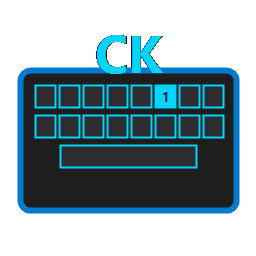

# ConquerKey

A simple .Net app to control Windows application by keyboard



## Installation

- .Net 9+ is required
- Download the latest executable from Releases page

## Development

Use the agents.md file to work with Copilot

To publish

- Update the version in csproj file
- Tag the release

```console
git tag -a v1.0.0 -m "Release version 1.0.0"
git push origin v1.0.0
```

- Build the exe

```console
dotnet publish -c Release
```

- Then create a release on GitHub and upload the .exe
